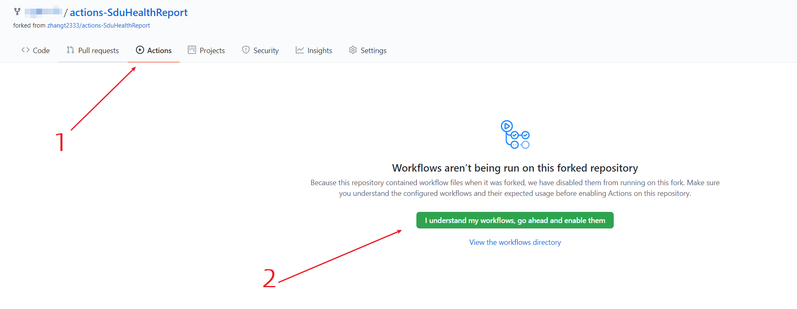
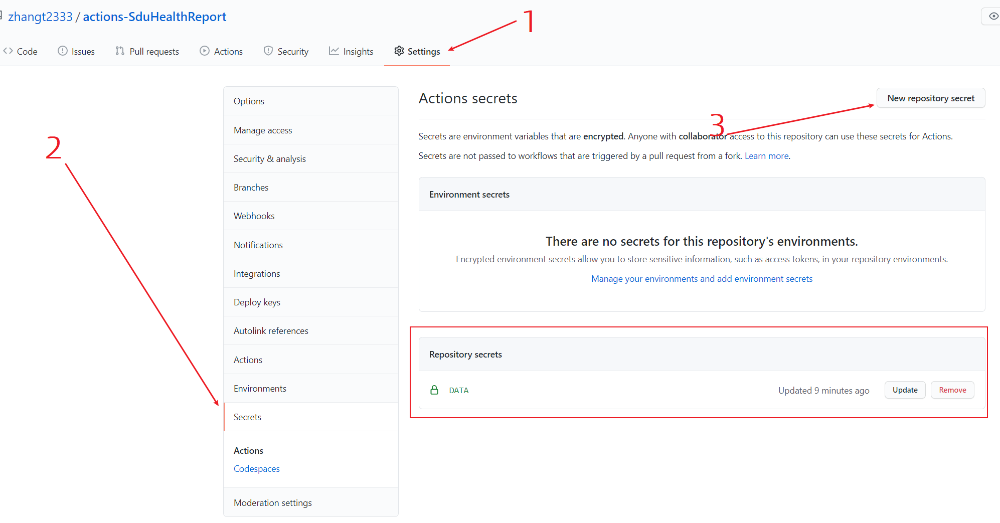

<div align="center">
<h1 align="center">体温上报助手</h1>
</div>

## 简介

每天 10:30 GMT+8 自动完成体温上报，如想修改定时运行的时间，可修改 `.github/workflows/SduHealthReport.yml` 中 `schedule` 属性。

**如果当日有异常，请手动在小程序端/PC 端填写！！！！！！！！！！！！**

## Github Actions 启用步骤

### 1. Fork 本项目

Fork 本项目: [zhangt2333/actions-SduHealthReport](https://github.com/zhangt2333/actions-SduHealthReport) (Star 自然是更好)

### 2. 准备需要的参数

```
{
    # fill them:
    'username': 'fill-it',  # 学号
    'password': 'fill-it',  # 密码
    'ZXSJ': 'fill-it',  # 手机
    'XM': 'fill-it',  # 姓名
    'XSXB': 'fill-it',  # 性别, 填 '男' 或 '女'
    'NL': 'fill-it',  # 年龄
    'FDYXMX': 'fill-it',  # 辅导员姓名
    'SZDW': 'fill-it',  # 学院全称, 如 计算机科学与技术学院
    'ZYMC': 'fill-it',  # 专业全称, 如 计算机科学与技术（菁英班）
    'JJLXRXM': 'fill-it',  # 家长姓名
    'JJLXRDH': 'fill-it',  # 家长手机
    'JJLXRYBRGX': 'fill-it',  # 和家长关系, 如 父子
    'sheng': 'fill-it',  # 省, 如 山东省
    'shi': 'fill-it',  # 市, 如 青岛市
    'quxian': 'fill-it',  # 区/县, 如 即墨区
    'DQJZDZ': 'fill-it',  # 具体地址, 如 山东省青岛市即墨区鳌山卫街道滨海路72号
    'EXTEST': '否No',  # 是否进行过核酸和血清抗体检测, 填 '否No' 或 '是Yes'

    # choose one, then annotate others:
    'DQSFJJIA': '在家At home',
    # 'DQSFJJIA': '在外Away from home',

    # choose one, then annotate others:
    'LXZT': '非学校所在城市Not in the city of the university',
    # 'LXZT': '学校所在城市In the city of the university',
    # 'LXZT': '境外Abroad',

    'none': 'none'
}
```

### 3. 启用 Github Actions



### 4. 将参数填到 Secrets

将填好的参数加入到 Secrets 中，name 为 `DATA`，value 为步骤 2 中的多行字符串



## 为多人打卡

1. 依照 `Github Actions 启用步骤` 第 2、4 步，添加新的 Secret，假设命名为 `DATA2`  

2. 复制一遍 `.github/workflows/SduHealthReport.yml` 中最后一行 `python health_report_helper/main.py "${{ secrets.DATA }}"` 并将其中的 `secrets.DATA` 中的 `DATA` 改为新 secrets 的键值。

3. 修改后的文件应如下所示（假设新键为`DATA2`）

```
  // .....
  - name: Run Spider
        run: |
          python health_report_helper/main.py "${{ secrets.DATA }}"
          python health_report_helper/main.py "${{ secrets.DATA2 }}"
```
